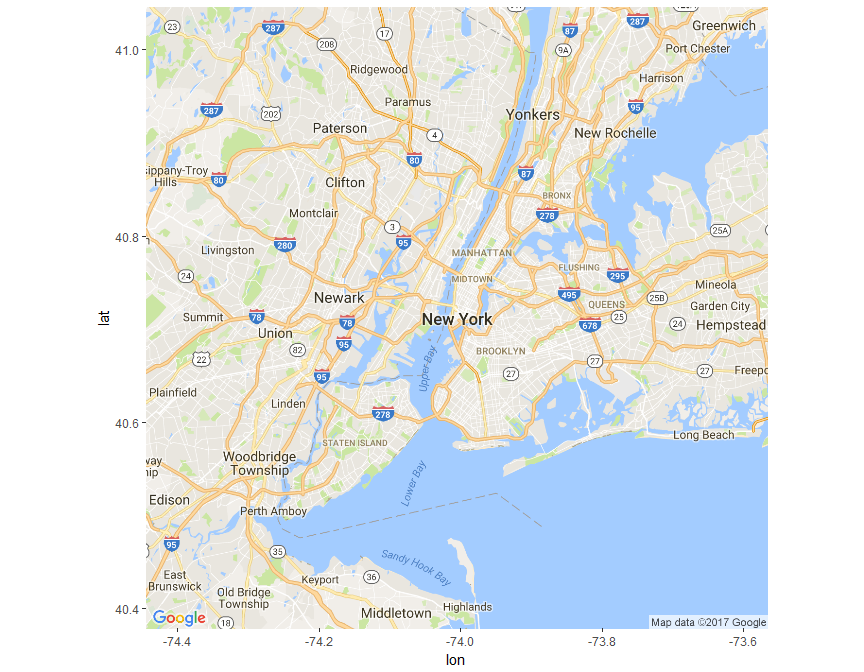
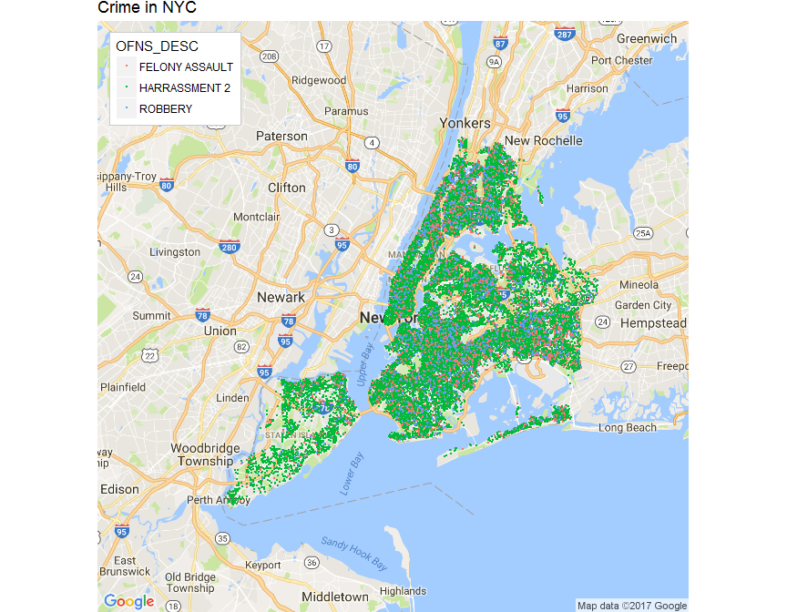
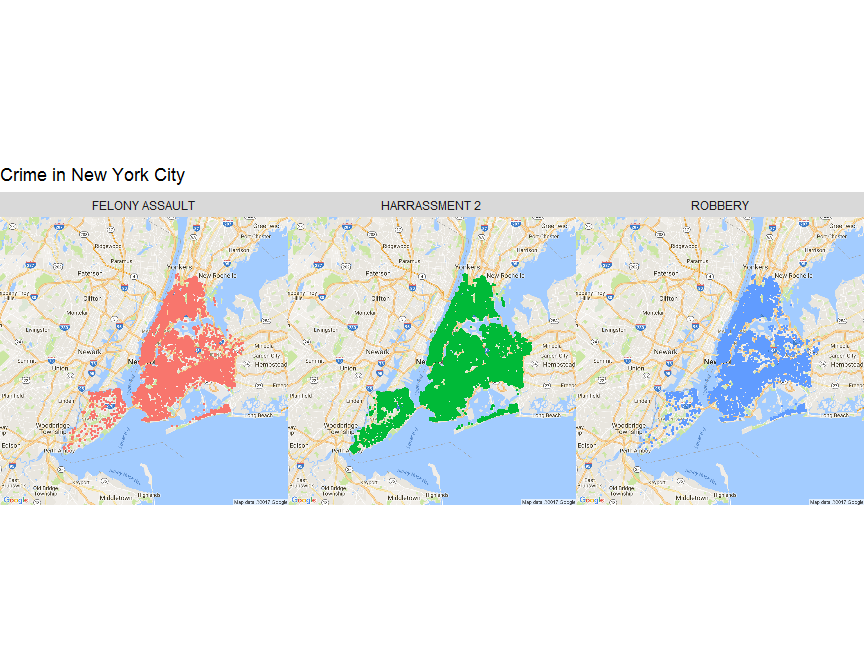
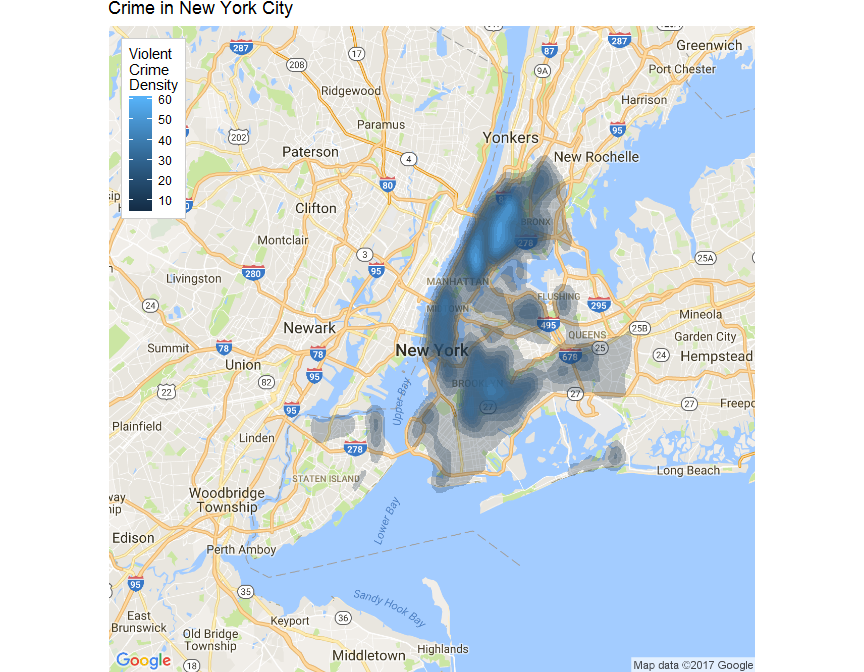
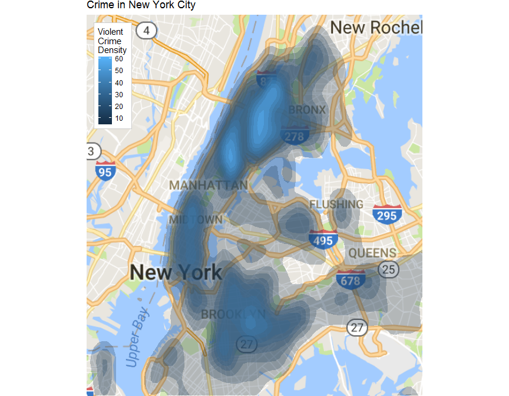
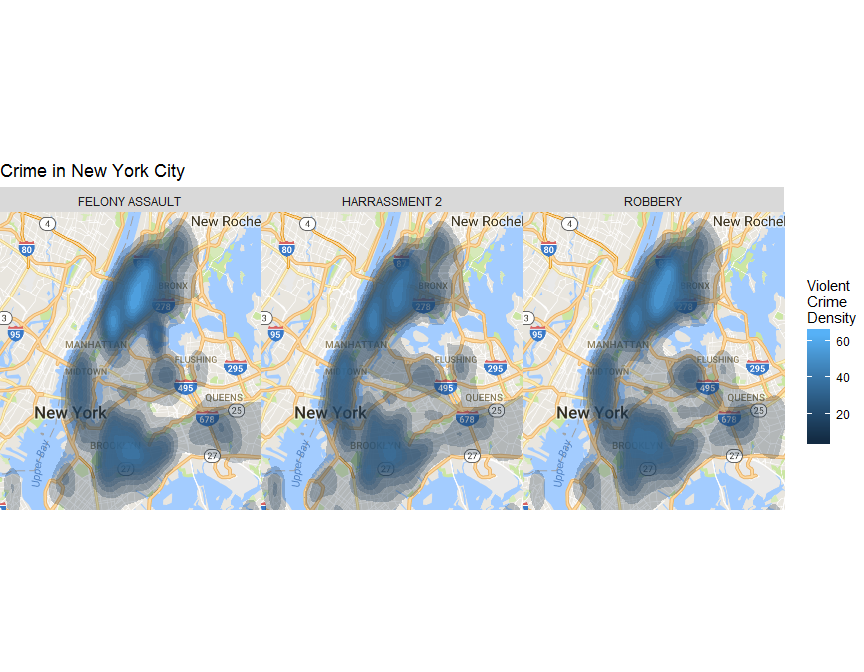

# Mapping and Visualizing Crime in New York
Zhaohu(Jonathan) Fan and Jingtong Feng  


# Project 1

## Introduction
The 2016 New York City crime dataset provides a special opportunity to play with data visually. As applied statisticians, we are interested in visualizing the crimes patterns near the neighborhood, Harlem. Since the dataset covers a wide variety of crimes, visualizing them all at once might wash out any patterns contained in smaller subgroups. We have elected to see if there are any patterns within three selected crimes (Robbery, Harrassment, and Felony Assault) that can be explored visually.

## The Data
The data set is accessible from the NYC Open Data (https://data.cityofnewyork.us/Public-Safety/NYPD-Complaint-Data-Current-YTD/5uac-w243)
For the sake of simplicity, We extract the variales of date and time of the incident occurence, boroughs, categories of the crimes, and the coordinates (latitude and longitude) of the incident. 

##  Data wrangling

```r
library(dplyr)
setwd("D:/One_Jing")
nycrime <- read.csv(file = "NYPD.csv", header = TRUE)
crime <- dplyr::select(nycrime, CMPLNT_NUM, CMPLNT_FR_DT, CMPLNT_FR_TM, BORO_NM, 
    OFNS_DESC, LAW_CAT_CD, Latitude, Longitude, Lat_Lon)
```
We primarily focus on the following three types of crime, robbery, harrassment, and felony assault.

```r
library(readr)
library(lubridate)

coltypes <- list(CMPLNT_FR_DT = col_datetime("%Y-%m-%d %H:%M:%S"))
unique(crime$OFNS_DESC)
```

```
##  [1] DANGEROUS DRUGS                     
##  [2] ROBBERY                             
##  [3] ASSAULT 3 & RELATED OFFENSES        
##  [4] FELONY ASSAULT                      
##  [5] MISCELLANEOUS PENAL LAW             
##  [6] VEHICLE AND TRAFFIC LAWS            
##  [7] DANGEROUS WEAPONS                   
##  [8] PETIT LARCENY                       
##  [9] GRAND LARCENY                       
## [10] CRIMINAL MISCHIEF & RELATED OF      
## [11] HARRASSMENT 2                       
## [12] BURGLARY                            
## [13] UNAUTHORIZED USE OF A VEHICLE       
## [14] OFFENSES INVOLVING FRAUD            
## [15] OFF. AGNST PUB ORD SENSBLTY &       
## [16] OFFENSES AGAINST PUBLIC ADMINI      
## [17] CRIMINAL TRESPASS                   
## [18] INTOXICATED & IMPAIRED DRIVING      
## [19] FORGERY                             
## [20] OFFENSES AGAINST THE PERSON         
## [21] SEX CRIMES                          
## [22] BURGLAR'S TOOLS                     
## [23] RAPE                                
## [24] THEFT-FRAUD                         
## [25] GRAND LARCENY OF MOTOR VEHICLE      
## [26] OTHER OFFENSES RELATED TO THEF      
## [27] FRAUDULENT ACCOSTING                
## [28] MURDER & NON-NEGL. MANSLAUGHTER     
## [29] FRAUDS                              
## [30] OFFENSES AGAINST PUBLIC SAFETY      
## [31] NYS LAWS-UNCLASSIFIED FELONY        
## [32] POSSESSION OF STOLEN PROPERTY       
## [33] GAMBLING                            
## [34] ADMINISTRATIVE CODE                 
## [35] AGRICULTURE & MRKTS LAW-UNCLASSIFIED
## [36] JOSTLING                            
## [37] ARSON                               
## [38] OTHER STATE LAWS (NON PENAL LA      
## [39] ESCAPE 3                            
## [40] PROSTITUTION & RELATED OFFENSES     
## [41] DISORDERLY CONDUCT                  
## [42] OFFENSES RELATED TO CHILDREN        
## [43] THEFT OF SERVICES                   
## [44] UNLAWFUL POSS. WEAP. ON SCHOOL      
## [45]                                     
## [46] KIDNAPPING & RELATED OFFENSES       
## [47] ALCOHOLIC BEVERAGE CONTROL LAW      
## [48] PETIT LARCENY OF MOTOR VEHICLE      
## [49] CHILD ABANDONMENT/NON SUPPORT       
## [50] ENDAN WELFARE INCOMP                
## [51] OTHER STATE LAWS (NON PENAL LAW)    
## [52] OTHER STATE LAWS                    
## [53] KIDNAPPING                          
## [54] INTOXICATED/IMPAIRED DRIVING        
## [55] LOITERING/GAMBLING (CARDS, DIC      
## [56] LOITERING                           
## [57] NYS LAWS-UNCLASSIFIED VIOLATION     
## [58] ANTICIPATORY OFFENSES               
## [59] HOMICIDE-NEGLIGENT-VEHICLE          
## [60] NEW YORK CITY HEALTH CODE           
## [61] DISRUPTION OF A RELIGIOUS SERV      
## [62] HOMICIDE-NEGLIGENT,UNCLASSIFIE      
## [63] ADMINISTRATIVE CODES                
## 63 Levels:  ADMINISTRATIVE CODE ... VEHICLE AND TRAFFIC LAWS
```

```r
mapdata <- crime %>% filter(crime$OFNS_DESC %in% c("ROBBERY", "HARRASSMENT 2", 
    "FELONY ASSAULT"))

mapdata <- na.omit(mapdata)
OFNS_DESC <- na.omit(mapdata$OFNS_DESC)
mapdata %>% group_by(OFNS_DESC) %>% summarise(n = n())
```

```
## # A tibble: 3 × 2
##        OFNS_DESC     n
##           <fctr> <int>
## 1 FELONY ASSAULT 20835
## 2  HARRASSMENT 2 65928
## 3        ROBBERY 15499
```
## Mapping
We build the map of NYC.


```r
library(ggplot2)
library(ggmap)
library(rgdal)
mapdata <- crime %>% filter(crime$OFNS_DESC %in% c("ROBBERY", "HARRASSMENT 2", 
    "FELONY ASSAULT"))
myLocation <- c("New York City")
map <- get_map(location = "New York City", zoom = 18, source = "google")
myMap <- get_map(location = myLocation, source = "google", scale = 2, maptype = "roadmap", 
    crop = FALSE)
ggmap(myMap)
```

<!-- -->

```r
# Building an obvious first map, one with a point for each crime in the
# dataset.
ggmap(myMap, extent = "device", legend = "topleft") + geom_point(aes(x = as.numeric(Longitude), 
    y = as.numeric(Latitude), color = OFNS_DESC), data = mapdata, size = 0.2) + 
    ggtitle("Crime in NYC") + scale_size(range = c(3, 20))
```

<!-- -->

## Comparing the three selected crimes
The colors all overlap and obscure one another. No patterns are readily visible. So we decide to create a map of three selected crimes will be more revealing.


```r
ggmap(myMap, extent = "device") + geom_point(aes(x = as.numeric(Longitude), 
    y = as.numeric(Latitude), colour = OFNS_DESC), data = mapdata, size = 0.2) + 
    scale_colour_discrete(guide = "none") + facet_wrap(~OFNS_DESC) + ggtitle("Crime in New York City") + 
    scale_size(range = c(3, 20))
```

<!-- -->

## Creating Density Map
Now let us try a contour plot. We estimate the density of crimes from longitude and latitudes, and use that to plot contours. This should more easily reveal patterns and hotspots for the selected crimes.

```r
contours <- stat_density2d(aes(x = as.numeric(Longitude), y = as.numeric(Latitude), 
    fill = ..level.., alpha = ..level..), size = 0.1, data = mapdata, n = 200, 
    geom = "polygon")
ggmap(myMap, extent = "device", legend = "topleft") + contours + scale_alpha_continuous(range = c(0.25, 
    0.4), guide = "none") + scale_fill_gradient("Violent\nCrime\nDensity") + 
    ggtitle("Crime in New York City")
```

<!-- -->

## Take a closer look of the Harlem area
This map seems much more informative. It reveals a giant hotspot in the Harlem neighborhood, with smaller hotspots in the surrounding neighborhoods. Additionally, there are spots in the southern Bronx area. So pull the map in to focus on these areas. Additionally, let us look at maps by specific category of crime.

```r
lims <- coord_map(xlim = c(-73.74, -74.1), ylim = c(40.61, 40.92))
ggmap(myMap, extent = "device", legend = "topleft") + lims + contours + scale_alpha_continuous(range = c(0.25, 
    0.4), guide = "none") + scale_fill_gradient("Violent\nCrime\nDensity") + 
    ggtitle("Crime in New York City")
```

<!-- -->

```r
ggmap(myMap, extent = "device") + lims + contours + scale_alpha_continuous(range = c(0.25, 
    0.4), guide = "none") + scale_fill_gradient("Violent\nCrime\nDensity") + 
    facet_wrap(~OFNS_DESC) + ggtitle("Crime in New York City")
```

<!-- -->

## Observation

- The overall structure of the contours seem to be about the same as the aggregate, with the largest hotspot centered in the harlem neighborhood southern Brox area. 

- With Felony Assault and Robbery, these occurrences seem to be much more concentrated. Additionally, a hotspot for Harassment appears in the same area.

- These three crime types generated the shades in the lower Manhattan area and Brooklyn area. 

## References
##### GGPlot2 Documentations[https://cran.r-project.org/web/packages/ggplot2/ggplot2.pdf].
##### GGPlot2 Quickstart [https://www.nceas.ucsb.edu/~frazier/RSpatialGuides/ggmap/ggmapCheatsheet.pdf].


